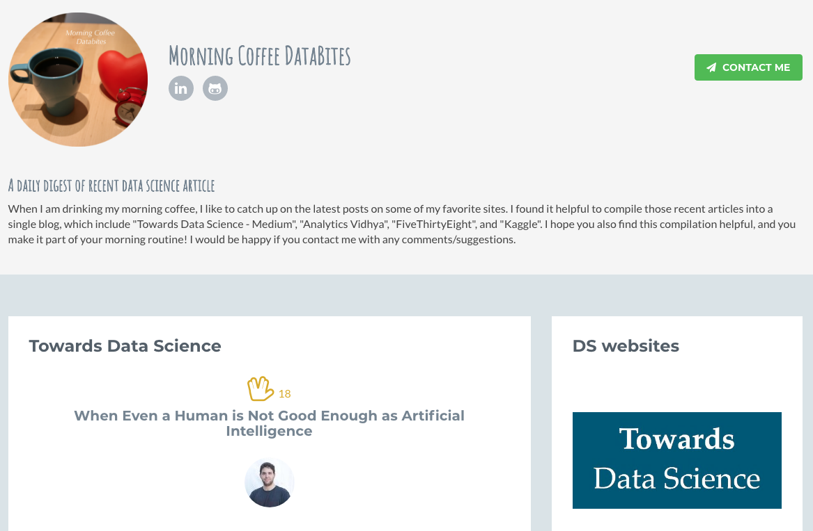

# Morning-Coffee-Databites

## A daily digest of recent data science article
When I am drinking my morning coffee, I like to catch up on the latest posts on some of my favorite sites. I found it helpful to compile those recent articles into a single blog, which include "Towards Data Science - Medium", "Analytics Vidhya", "FiveThirtyEight", and "Kaggle". I hope you also find this compilation helpful, and you make it part of your morning routine! I would be happy if you contact me with any comments/suggestions.

Check the web app! [Here](http://morning-coffee.herokuapp.com/)

### Tools/Skills
- WebScraping (Python/BeautifulSoup)
- Natural Language Processing (Python/NLTK)
- Flask
- Jinja2
