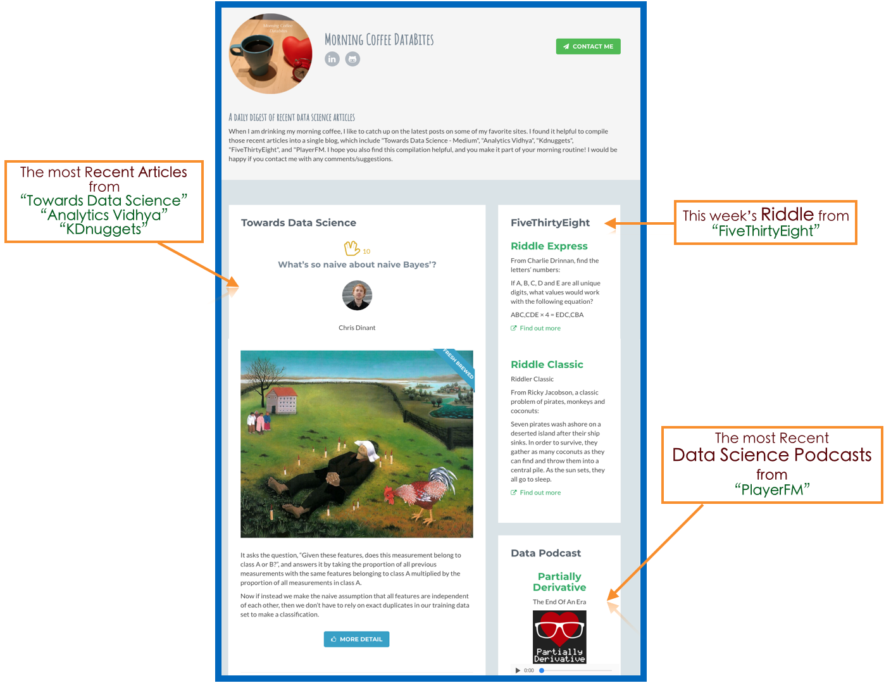

# Morning-Coffee-Databites
<a href="http://morning-coffee.herokuapp.com" target="_blank">Proceed to "Morning Coffee Databites</a>
[Proceed to "Morning Coffee Databites]("http://morning-coffee.herokuapp.com"){:target="_blank"}

The goal of this project was to compile a useful website with all the recent articles related to data science and machine learning from websites I like following. It was also an opportunity to demonstrate my skills in (1) live web scraping and (2) summarizing articles with Python/NLTK, and building a web app with Flask/Heroku. This one week project came together in early May/2018. This web app includes:

- Towards Data Science 
- Analytics Vidhya
- Kdnuggets (news)
- FiveThirtyEight (Riddler)
- PlayerFM (Data Science)

I would be happy if you contact me with any comments/suggestions! (mhan3141@gmail.com)

## A daily digest of recent data science article
When I am drinking my morning coffee, I like to catch up on the latest posts on some of my favorite sites. I found it helpful to compile those recent articles into a single blog, which include "Towards Data Science - Medium", "Analytics Vidhya", "Kdnuggets", "FiveThirtyEight", and "PlayerFM. I hope you also find this compilation helpful, and you make it part of your morning routine! 

Check the web app! [Here](http://morning-coffee.herokuapp.com/)

### Tools/Skills
- WebScraping (Python/[BeautifulSoup](https://www.crummy.com/software/BeautifulSoup/))
- Natural Language Processing (Python/[NLTK](https://www.nltk.org/))
- [Flask](http://flask.pocoo.org/)/[Heroku](https://dashboard.heroku.com/)
- [Jinja2](http://jinja.pocoo.org/docs/2.10/)
